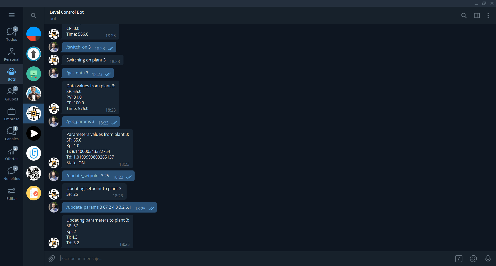

# telegram-bot-level-control
Telegram Bot to manage the level and sensors of 6 tanks. This project is another way of monitor and control the IoT Control System described in my repository [tank-level-control](https://github.com/davidadrianrg/tank-level-control) .
---
***


***
## Installation
Clone the repository in your local folder:
```bash
git clone https://github.com/davidadrianrg/telegram-bot-level-control.git
```
Install python dependencies using ```pip3``` python package manager:
```bash
pip3 install python-telegram-bot paho.mqtt pyyaml
```
Change the ```configuration.yaml``` according to your mqtt network settings and your telegram api token given by [Telegram Bot Father](https://t.me/botfather) :
```yaml
telegram:
  token: PUT YOUR TELEGRAM API TOKEN HERE

mqtt:
  broker: PUT YOUR MQTT BROKER IP
  port: 1883
  user: PUT YOUR MQTT BROKER USER
  passwd: PUT YOUR MQTT BROKER PASSWORD 
```
***
## Usage
Run ```level-control-bot.py``` to initialize the bot polling.